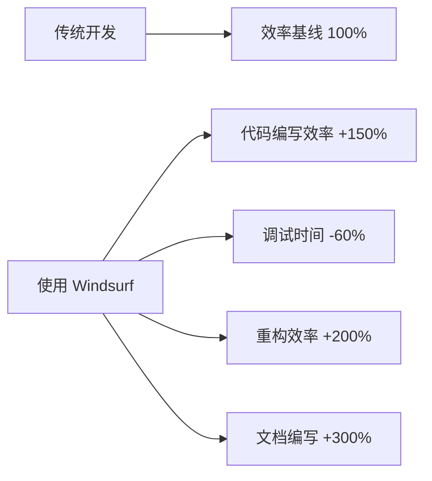

# 1. 简介

## 1.1 什么是 Windsurf？

Windsurf 是由 ### 1.4.1 支持的编程语言造的新一代 agentic AI 编程助手。它基于 AI Flow 范式，能够独立或协作地完成编程任务，极大提升开发效率。

### 1.1.1 主要特点

- **智能理解**：能够理解代码、文档和自然语言描述
- **学习能力**：从用户交互中持续学习和改进
- **多语言支持**：支持主流编程语言和开发框架
- **协作友好**：提供团队协作和版本控制功能

### 1.1.2 与传统IDE的区别

| 特性 | 传统IDE | Windsurf |
|------|---------|----------|
| 代码补全 | 基于规则的简单补全 | AI驱动的智能补全 |
| 错误检测 | 静态分析 | 智能分析+预测性检测 |
| 重构能力 | 预定义模式 | 智能理解+自定义重构 |
| 学习能力 | 无 | 持续学习用户习惯 |

## 1.2 核心理念

- **AI Flow**：Windsurf 能够自动化多步开发流程，不仅仅是代码补全，而是主动理解、分解并执行复杂任务。
- **Agentic 编程**：Windsurf 具备自主行动能力，可以根据开发目标自主查找、修改、创建代码，甚至运行命令和自动化测试。
- **深度代码集成**：通过强大的代码搜索、导航与编辑工具，Windsurf 能够深入理解和操作整个项目代码库。
- **持久化记忆**：Windsurf 拥有持久化记忆系统，能够记住项目上下文、用户偏好和历史决策，持续优化协作体验。

## 1.3 适用场景

- 个人开发者希望提升编码效率、减少重复性工作
- 团队开发中需要更智能的协作助手
- 需要自动化代码分析、重构、测试和部署的场景
- 希望快速理解和上手大型代码库的开发者

## 1.4 Windsurf 的优势

- 全面集成开发工具链，支持代码搜索、编辑、运行、测试、部署等全流程
- 支持自然语言与代码混合交互，降低学习门槛
- 自动化多步开发任务，节省时间、减少人为错误
- 持久化记忆和上下文理解，使协作更高效

### 1.4.1 效率提升数据

根据用户反馈和使用统计，Windsurf 能够带来显著的效率提升：

### 1.4.1 支持的编程语言

**主流编程语言：**

- Python（包括 Django、Flask 等框架）
- JavaScript/TypeScript（Node.js、React、Vue 等）
- Java（Spring Boot、Maven 等）
- C#（.NET Core、ASP.NET）
- Go、Rust 等现代语言

**开发工具集成：**

- 版本控制：Git、GitHub、GitLab
- 数据库：MySQL、PostgreSQL、MongoDB
- 云平台：AWS、Azure、Google Cloud
- 容器化：Docker、Kubernetes

## 1.5 开始使用 Windsurf

选择 Windsurf 作为开发工具，您将获得：

- **更快的开发速度**：智能代码补全和生成
- **更少的错误**：AI 辅助的代码检查和建议
- **更好的协作**：团队开发和知识共享
- **持续学习**：工具会适应您的编程习惯

---

> 下一章：[环境准备](./2-环境准备.md)

## 练习

1. **了解 Windsurf**：访问 Windsurf 官网，了解基本功能和特点
2. **需求分析**：思考您当前开发中遇到的问题，例如代码补全效率、调试耗时等
3. **学习计划**：制定学习 Windsurf 的简单计划，确定想要实现的基本目标
4. **语言支持**：了解 Windsurf 对您常用编程语言的支持情况