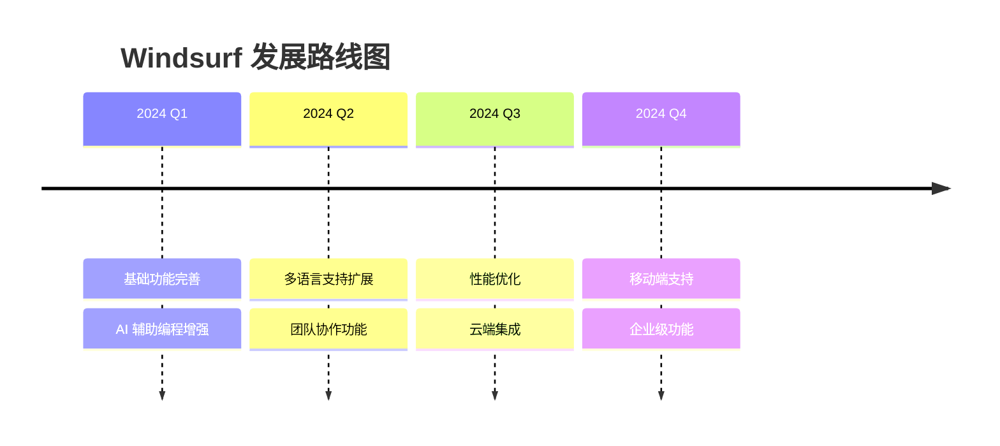
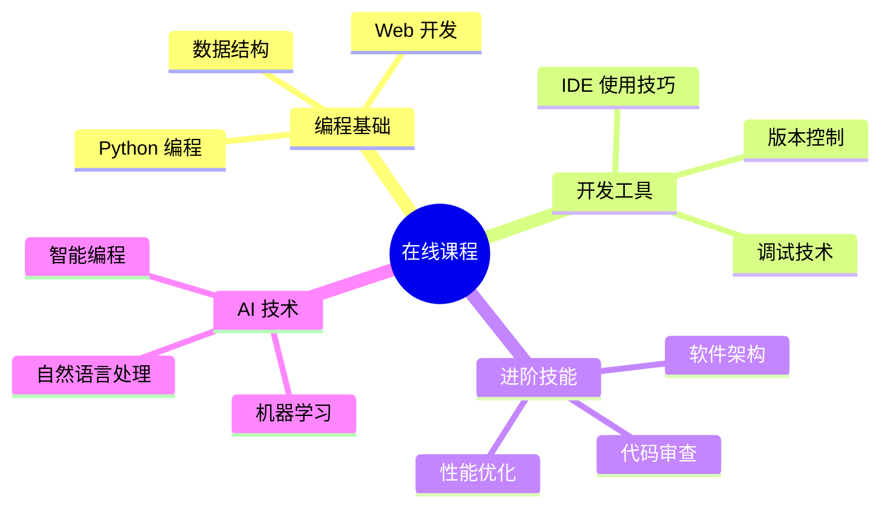
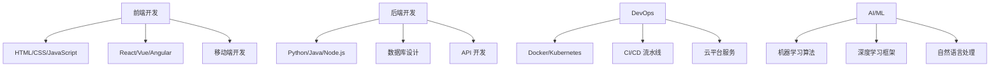
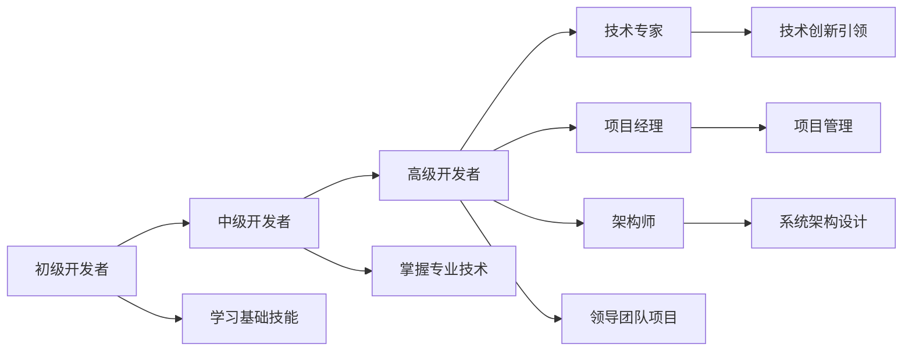

# 10. 资源推荐与后续学习

## 10.1 官方资源

### 10.1.1 官方文档
Windsurf 官方提供了完整的文档资源：

- **官方网站**: [https://windsurf.dev](https://windsurf.dev)
- **用户手册**: 详细的功能说明和使用指南
- **API 文档**: 扩展开发和集成文档
- **快速入门**: 新用户指导教程

### 10.1.2 官方论坛
- **社区讨论**: 用户交流和问题讨论
- **功能请求**: 提出新功能建议
- **Bug 报告**: 问题反馈和跟踪
- **最佳实践**: 官方推荐的使用方法

### 10.1.3 更新日志与路线图


**关注更新的方式：**
- 订阅官方邮件列表
- 关注官方社交媒体
- 定期查看更新日志
- 参与 Beta 测试

## 10.2 学习资源

### 10.2.1 推荐书籍

**编程工具相关：**
1. **《高效程序员的45个习惯》** - 提升开发效率
2. **《代码整洁之道》** - 编写高质量代码
3. **《重构：改善既有代码的设计》** - 代码重构技巧
4. **《持续集成》** - 自动化开发流程

**AI 辅助编程：**
1. **《人工智能编程实战》** - AI 在编程中的应用
2. **《机器学习实战》** - 理解 AI 工作原理
3. **《深度学习编程》** - 深入了解 AI 技术

### 10.2.2 在线课程

**推荐平台：**
- **Coursera**: 计算机科学和编程课程
- **edX**: 免费的高质量编程课程
- **Udemy**: 实用的技术技能课程
- **B站**: 中文编程教学视频

**专题课程：**


### 10.2.3 技术博客

**优质博客推荐：**
- **阮一峰的网络日志**: 技术趋势和工具介绍
- **掘金**: 中文技术社区
- **Medium**: 英文技术文章
- **InfoQ**: 企业级技术内容

**关注领域：**
- 开发工具最新动态
- 编程最佳实践
- AI 技术发展
- 软件工程方法论

## 10.3 社区资源

### 10.3.1 开源项目

**参与开源的好处：**
- 提升编程技能
- 建立技术声誉
- 扩展人脉网络
- 获得实战经验

**推荐开源平台：**
```json
{
  "platforms": {
    "GitHub": {
      "description": "全球最大的代码托管平台",
      "features": ["代码托管", "协作开发", "社区讨论"]
    },
    "GitLab": {
      "description": "完整的 DevOps 平台",
      "features": ["CI/CD", "项目管理", "代码审查"]
    },
    "Gitee": {
      "description": "中国本土代码托管平台",
      "features": ["中文界面", "本地化服务", "企业支持"]
    }
  }
}
```

### 10.3.2 开发者社区

**国际社区：**
- **Stack Overflow**: 编程问答社区
- **Reddit**: r/programming 等技术版块
- **Discord**: 实时交流和讨论
- **Slack**: 技术团队协作

**中文社区：**
- **CSDN**: 中文技术博客和问答
- **博客园**: 程序员技术博客
- **开源中国**: 中文开源社区
- **V2EX**: 创意工作者社区

### 10.3.3 技术大会与活动

**国际会议：**
- **Google I/O**: Google 技术大会
- **Apple WWDC**: 苹果开发者大会
- **Microsoft Build**: 微软开发者大会
- **GitHub Universe**: GitHub 年度大会

**国内活动：**
- **QCon**: 软件开发大会
- **GIAC**: 全球互联网架构大会
- **DevOps 中国峰会**: 运维开发大会
- **各地技术 Meetup**: 本地技术交流

## 10.4 进阶学习路径

### 10.4.1 相关技术栈

**全栈开发路径：**


**专业化方向：**
1. **前端工程师**
   - 掌握现代前端框架
   - 学习前端工程化工具
   - 关注用户体验设计

2. **后端工程师**
   - 深入学习服务器技术
   - 掌握数据库优化
   - 了解分布式系统

3. **全栈工程师**
   - 前后端技术并重
   - 学习系统架构设计
   - 掌握项目管理技能

4. **AI 工程师**
   - 学习机器学习算法
   - 掌握深度学习框架
   - 关注 AI 应用场景

### 10.4.2 认证与考试

**行业认证：**
- **AWS 认证**: 云计算技能认证
- **Google 云认证**: Google 云平台技能
- **Microsoft 认证**: Azure 和 Office 365
- **Oracle 认证**: 数据库和 Java 技能

**技能评估：**
- **LeetCode**: 算法和数据结构
- **HackerRank**: 编程技能测试
- **Codewars**: 编程挑战
- **Project Euler**: 数学编程问题

### 10.4.3 贡献指南

**为 Windsurf 社区贡献：**
1. **文档改进**
   - 修正文档错误
   - 翻译英文文档
   - 编写使用教程

2. **扩展开发**
   - 开发实用扩展
   - 分享配置模板
   - 创建主题插件

3. **社区建设**
   - 回答用户问题
   - 分享使用经验
   - 组织线下活动

## 10.5 持续学习建议

### 10.5.1 学习计划制定

**个人学习计划模板：**
```markdown
# 学习计划

## 目标设定
- 短期目标（3个月）：掌握 Windsurf 高级功能
- 中期目标（6个月）：成为团队 Windsurf 专家
- 长期目标（1年）：贡献开源项目

## 学习内容
1. 每周学习新功能（2小时）
2. 每月完成实战项目（1个）
3. 每季度参加技术活动（1次）

## 评估方式
- 功能掌握程度测试
- 项目完成质量评估
- 社区贡献活跃度
```

### 10.5.2 技术趋势跟踪

**关注重点：**
1. **AI 技术发展**
   - 大语言模型进展
   - 代码生成技术
   - 智能开发工具

2. **开发工具演进**
   - 云端开发环境
   - 低代码/无代码平台
   - 协作开发工具

3. **编程语言趋势**
   - 新兴编程语言
   - 语言特性更新
   - 性能优化技术

**信息来源：**
- 技术新闻网站
- 开发者调查报告
- 会议演讲视频
- 开源项目动态

### 10.5.3 实践项目推荐

**初级项目：**
1. **个人博客系统** - 全栈开发入门
2. **待办事项应用** - CRUD 操作练习
3. **天气查询工具** - API 集成实践

**中级项目：**
1. **在线聊天室** - 实时通信技术
2. **电商平台** - 复杂业务逻辑
3. **内容管理系统** - 权限管理

**高级项目：**
1. **分布式系统** - 微服务架构
2. **AI 应用开发** - 机器学习集成
3. **开源工具贡献** - 社区参与

## 10.6 职业发展建议

### 10.6.1 技能发展路径



### 10.6.2 软技能培养

**重要软技能：**
- 沟通协作能力
- 问题解决思维
- 学习适应能力
- 项目管理技能
- 领导力发展

### 10.6.3 行业洞察

**关注行业动态：**
- 技术发展趋势
- 市场需求变化
- 职业机会分析
- 薪资水平调研

---

## 结语

学习是一个持续的过程，Windsurf 作为强大的开发工具，将伴随你的编程之旅不断进化。通过合理利用各种学习资源，积极参与社区建设，保持对新技术的敏感度，你将能够在快速变化的技术环境中保持竞争优势。

记住，工具只是手段，解决问题的思维和持续学习的能力才是程序员最宝贵的财富。愿你在编程的道路上越走越远，用技术创造更美好的世界！

## 练习

1. 制定个人技术学习计划
2. 选择一个开源项目进行贡献
3. 参加本地技术社区活动
4. 建立个人技术博客
5. 完成一个完整的实战项目
