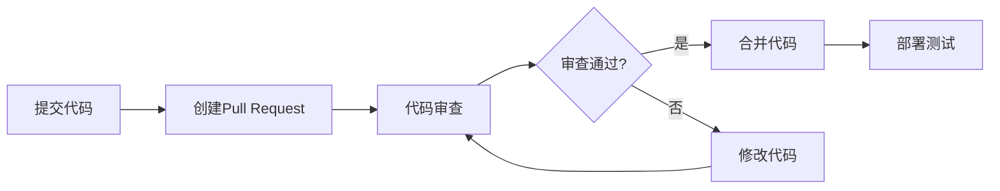
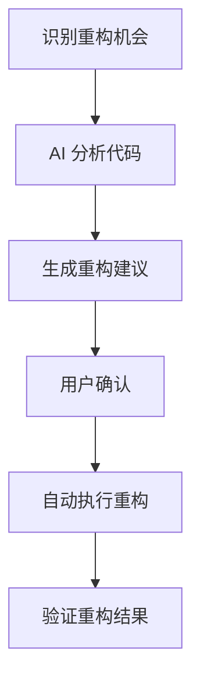

# 8. 进阶技巧与最佳实践

## 8.1 高级代码搜索技巧

### 8.1.1 正则表达式搜索

**常用正则表达式模式：**

```regex
# 查找所有符合邮箱格式的字符串
\b[A-Za-z0-9._%+-]+@[A-Za-z0-9.-]+\.[A-Z|a-z]{2,}\b

# 查找未使用的导入语句
^import\s+.*?;\s*$(?<!//.*$)

# 查找函数定义
def\s+(\w+)\s*\([^)]*\):

# 查找注释行
^\s*#.*$

# 查找空行
^\s*$
```

**高级搜索技巧：**
- **使用捕获组**: `(\w+)\.(\w+)` 捕获对象和方法
- **前后查找断言**: `(?<=function\s)\w+` 查找函数名
- **非贪婪匹配**: `.*?` 最小匹配
- **字符类**: `[a-zA-Z0-9_]` 匹配字母数字下划线

**正则表达式速查表：**

| 符号 | 含义 | 示例 |
|------|------|------|
| `.` | 任意字符 | `a.c` 匹配 abc, adc |
| `*` | 0次或多次 | `ab*` 匹配 a, ab, abb |
| `+` | 1次或多次 | `ab+` 匹配 ab, abb |
| `?` | 0次或1次 | `ab?` 匹配 a, ab |
| `^` | 行开始 | `^hello` 匹配行首的hello |
| `$` | 行结束 | `world$` 匹配行尾的world |

### 8.1.2 多文件搜索策略
- 按文件类型过滤
- 排除特定目录
- 保存常用搜索条件

### 8.1.3 搜索优化技巧
- 使用通配符进行模糊匹配
- 搜索结果预览与导航
- 搜索历史记录管理

## 8.2 高效代码编辑技巧

### 8.2.1 多光标操作

**基本多光标操作：**
- **Alt+Click**: 在点击位置添加新光标
- **Ctrl+D** (Windows/Linux) 或 **Cmd+D** (macOS): 选择下一个匹配项
- **Ctrl+Shift+L** (Windows/Linux) 或 **Cmd+Shift+L** (macOS): 选择所有匹配项
- **Alt+Shift+拖动**: 列选择模式

**实用场景：**
1. **批量重命名变量**
   ```python
   # 同时修改多个相同的变量名
   old_variable = 1
   old_variable = 2
   old_variable = 3
   ```

2. **批量添加代码**
   ```javascript
   // 为多行同时添加 console.log
   function1();
   function2();
   function3();
   ```

3. **格式化数据**
   ```csv
   # 为CSV数据添加引号
   name,age,city
   John,25,New York
   Jane,30,London
   ```

### 8.2.2 代码片段管理
```json
{
  "Print to console": {
    "prefix": "log",
    "body": [
      "console.log('$1', $1);",
      "$2"
    ],
    "description": "Log output to console"
  }
}
```
- 创建自定义代码片段
- 导入/导出代码片段
- 分享代码片段配置

### 8.2.3 键盘快捷键优化
- 常用操作快捷键映射
- 自定义快捷键组合
- 快捷键冲突解决方案

## 8.3 团队协作最佳实践

### 8.3.1 代码审查流程

**有效的代码审查流程：**



**代码审查清单：**
- [ ] 代码逻辑是否正确
- [ ] 是否遵循编码规范
- [ ] 性能是否有问题
- [ ] 安全漏洞检查
- [ ] 测试覆盖率是否足够
- [ ] 文档是否更新

**审查工具集成：**
- **GitHub/GitLab**: 内置审查工具
- **SonarQube**: 代码质量分析
- **ESLint/Prettier**: 代码风格检查
- **CodeClimate**: 技术债务跟踪

### 8.3.2 代码风格统一
- 使用 EditorConfig 配置
- 集成 Prettier/ESLint
- 提交前代码检查

### 8.3.3 Git 工作流
```bash
# 推荐的分支命名规范
feature/feature-name
bugfix/issue-number
docs/update-readme
```
- 功能分支策略
- 提交信息规范
- 代码合并最佳实践

## 8.4 性能优化建议

### 8.4.1 大型项目管理
- 工作区配置优化
- 文件排除模式设置
- 内存使用监控

### 8.4.2 编辑器性能
- 禁用不必要的扩展
- 调整自动保存间隔
- 文件监听配置

### 8.4.3 响应速度优化
- 延迟加载大型文件
- 后台进程管理
- 缓存清理策略

## 8.5 自定义配置

### 8.5.1 工作区设置
```json
{
  "files.exclude": {
    "**/.git": true,
    "**/.DS_Store": true,
    "**/node_modules": true
  },
  "editor.formatOnSave": true,
  "editor.codeActionsOnSave": {
    "source.organizeImports": true
  }
}
```

### 8.5.2 推荐扩展
- 代码质量工具
- 版本控制增强
- 语言支持包

### 8.5.3 主题与界面
- 自定义颜色主题
- 图标主题设置
- 界面布局优化

## 8.6 调试技巧

### 8.6.1 断点调试
- 条件断点
- 日志点设置
- 调用堆栈分析

### 8.6.2 性能分析
- CPU 分析
- 内存泄漏检测
- 性能时间线

## 8.7 安全最佳实践

### 8.7.1 代码安全
- 敏感信息处理
- 依赖安全检查
- 安全扫描集成

### 8.7.2 访问控制
- 项目权限管理
- 环境变量安全
- 认证信息存储

## 8.8 Windsurf AI 高级应用

### 8.8.1 AI 辅助重构
Windsurf 的 AI 能力在代码重构中发挥重要作用：



**AI 重构优势：**
- 自动识别代码异味
- 建议最佳实践
- 保持代码风格一致性
- 减少人为错误

### 8.8.2 智能代码生成
- 根据注释生成函数实现
- 自动补全复杂数据结构
- 生成测试用例骨架
- API 文档自动生成

### 8.8.3 上下文感知编程
- 项目历史记忆
- 编码模式学习
- 个性化建议
- 团队习惯适应

## 8.9 企业级开发实践

### 8.9.1 大规模项目管理
```json
{
  "workspace": {
    "folders": [
      {"path": "./frontend"},
      {"path": "./backend"},
      {"path": "./shared"}
    ],
    "settings": {
      "search.exclude": {
        "**/node_modules": true,
        "**/dist": true
      }
    }
  }
}
```

### 8.9.2 代码质量保证
- 静态代码分析集成
- 自动化代码审查
- 质量门禁设置
- 技术债务管理

### 8.9.3 持续集成最佳实践
- CI/CD 流水线配置
- 自动化测试策略
- 部署环境管理
- 监控与告警

## 8.10 常见问题解答

### Q: 如何优化 Windsurf 在大型项目中的性能？
**A:** 
1. 配置文件排除模式，减少索引文件数量
2. 关闭不必要的扩展和功能
3. 使用工作区设置而非全局设置
4. 定期清理缓存和日志文件

### Q: 如何在团队中推广 Windsurf 使用？
**A:**
1. 从小团队或项目开始试点
2. 建立团队代码规范和配置标准
3. 定期分享使用技巧和最佳实践
4. 收集反馈并持续改进工作流

### Q: 如何处理 Windsurf 与现有工具的集成？
**A:**
1. 评估现有工具链的必要性
2. 逐步迁移关键功能
3. 保持向后兼容性
4. 建立备用方案

---

> 下一章：[常见问题与解决方案](./9-常见问题与解决方案.md)

## 练习

1. 配置一个适合团队协作的 Windsurf 工作区
2. 创建自定义代码片段库
3. 设置自动化代码质量检查流程
4. 优化大型项目的 Windsurf 性能配置
5. 建立团队代码审查最佳实践
