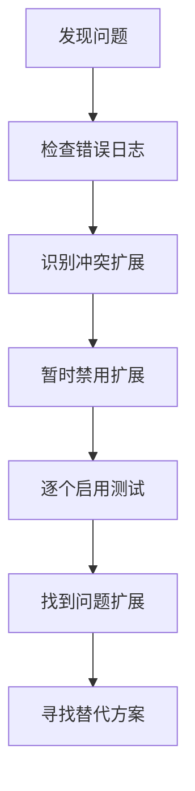
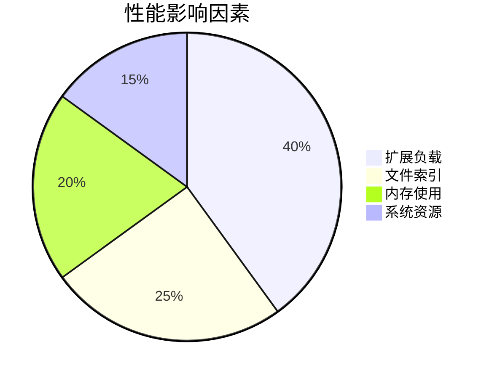
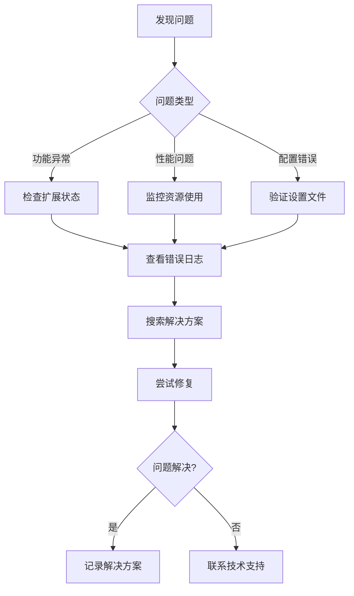

# 9. 常见问题与解决方案

## 9.1 安装与配置问题

### 9.1.1 环境变量配置问题

**问题：** Windsurf 无法找到 Python 或 Node.js 解释器

**解决方案：**
```bash
# macOS/Linux 环境变量配置
export PATH="/usr/local/bin/python3:$PATH"
export PATH="/usr/local/bin/node:$PATH"

# Windows 环境变量配置
# 在系统属性 > 高级 > 环境变量中添加路径
```

**常见步骤：**
1. 检查 PATH 环境变量
2. 重启 Windsurf 应用
3. 验证解释器路径
4. 更新系统环境变量

### 9.1.2 依赖冲突解决方案

**问题表现：**
- 扩展安装失败
- 功能异常或崩溃
- 版本兼容性问题

**排查流程：**


### 9.1.3 插件安装失败处理

**常见原因：**
- 网络连接问题
- 权限不足
- 存储空间不足
- 版本不兼容

**解决步骤：**
1. 检查网络连接
2. 以管理员权限运行
3. 清理缓存目录
4. 手动下载安装

## 9.2 功能使用问题

### 9.2.1 代码补全不工作

**诊断清单：**
- [ ] 检查语言服务器状态
- [ ] 验证项目配置文件
- [ ] 确认扩展是否启用
- [ ] 重启语言服务器

**解决方案：**
```json
{
  "python.languageServer": "Pylance",
  "python.analysis.autoImportCompletions": true,
  "python.analysis.completeFunctionParens": true
}
```

### 9.2.2 搜索功能异常

**问题类型：**
1. **搜索结果不准确**
   - 检查搜索范围设置
   - 验证文件包含/排除规则
   - 更新搜索索引

2. **搜索速度缓慢**
   - 排除大型文件目录
   - 限制搜索范围
   - 优化索引配置

### 9.2.3 快捷键冲突

**冲突检测：**
```bash
# 打开快捷键设置
Ctrl+K Ctrl+S (Windows/Linux)
Cmd+K Cmd+S (macOS)
```

**解决策略：**
- 识别冲突的快捷键
- 重新分配键位
- 禁用不必要的快捷键
- 使用快捷键组合

## 9.3 性能问题

### 9.3.1 编辑器响应缓慢

**性能监控：**


**优化方案：**
1. **减少扩展负载**
   - 禁用不必要的扩展
   - 使用工作区特定扩展
   - 定期清理扩展

2. **优化文件索引**
   ```json
   {
     "files.exclude": {
       "**/.git": true,
       "**/node_modules": true,
       "**/.vscode": true,
       "**/dist": true,
       "**/build": true
     }
   }
   ```

### 9.3.2 内存占用过高

**内存监控：**
- 使用任务管理器监控内存使用
- 查看 Windsurf 进程详情
- 识别内存泄漏模式

**优化策略：**
- 关闭不使用的标签页
- 限制同时打开的文件数量
- 调整自动保存频率
- 清理临时文件

### 9.3.3 索引速度优化

**索引配置：**
```json
{
  "search.followSymlinks": false,
  "search.useRipgrep": true,
  "files.watcherExclude": {
    "**/.git/objects/**": true,
    "**/node_modules/**": true
  }
}
```

## 9.4 集成问题

### 9.4.1 版本控制系统集成问题

**Git 集成故障排除：**
1. **无法识别 Git 仓库**
   ```bash
   # 检查 Git 配置
   git config --list
   
   # 初始化仓库
   git init
   ```

2. **权限认证问题**
   ```bash
   # 配置 SSH 密钥
   ssh-keygen -t rsa -b 4096 -C "your_email@example.com"
   
   # 配置 Git 用户信息
   git config --global user.name "Your Name"
   git config --global user.email "your_email@example.com"
   ```

### 9.4.2 外部工具集成

**常见集成工具：**
- Docker 容器
- 数据库客户端
- API 测试工具
- 部署平台

**集成检查清单：**
- [ ] 工具路径配置正确
- [ ] 环境变量设置完整
- [ ] 权限配置适当
- [ ] 版本兼容性确认

### 9.4.3 团队协作问题

**共享配置管理：**
```json
// .vscode/settings.json (项目级别)
{
  "editor.tabSize": 2,
  "editor.insertSpaces": true,
  "files.encoding": "utf8",
  "files.eol": "\n"
}
```

**协作最佳实践：**
- 使用项目级配置文件
- 统一代码格式化规则
- 建立代码审查流程
- 定期同步开发环境

## 9.5 错误处理

### 9.5.1 常见错误代码解析

**错误代码对照表：**

| 错误代码 | 描述 | 解决方案 |
|---------|------|---------|
| E001 | 文件权限错误 | 检查文件权限设置 |
| E002 | 网络连接超时 | 检查网络连接和防火墙 |
| E003 | 内存不足 | 关闭不必要的应用程序 |
| E004 | 配置文件损坏 | 重置或修复配置文件 |

### 9.5.2 日志查看与分析

**日志位置：**
```bash
# macOS
~/Library/Application Support/Windsurf/logs/

# Windows
%APPDATA%\Windsurf\logs\

# Linux
~/.config/Windsurf/logs/
```

**日志分析技巧：**
- 按时间戳排序
- 搜索错误关键词
- 关注警告信息
- 导出日志用于技术支持

### 9.5.3 问题排查流程



**排查步骤：**
1. **问题复现**
   - 记录操作步骤
   - 确认触发条件
   - 收集环境信息

2. **信息收集**
   - 错误截图
   - 日志文件
   - 系统配置
   - 版本信息

3. **解决方案搜索**
   - 官方文档
   - 社区论坛
   - 已知问题列表
   - 技术博客

4. **问题修复**
   - 按步骤执行解决方案
   - 验证修复效果
   - 做好备份工作
   - 记录解决过程

## 9.6 预防性维护

### 9.6.1 定期维护任务

**每周维护：**
- 清理临时文件
- 更新扩展
- 备份配置
- 检查性能指标

**每月维护：**
- 系统优化
- 配置审查
- 安全检查
- 培训更新

### 9.6.2 备份与恢复

**配置备份：**
```bash
# 备份设置文件
cp ~/.config/windsurf/settings.json ~/backup/

# 备份扩展列表
windsurf --list-extensions > ~/backup/extensions.txt
```

**恢复配置：**
```bash
# 恢复设置
cp ~/backup/settings.json ~/.config/windsurf/

# 批量安装扩展
cat ~/backup/extensions.txt | xargs -n 1 windsurf --install-extension
```

---

> 下一章：[资源推荐与后续学习](./10-资源推荐与后续学习.md)

## 练习

1. 设置完整的错误日志监控流程
2. 创建个人问题解决方案知识库
3. 配置自动化备份系统
4. 建立团队技术支持流程
5. 优化开发环境性能配置
